# Задание 1 
1)	Создайте новую директорию для проекта, назовите ее вашей фамилией с вашими инициалами и перейдите в неё
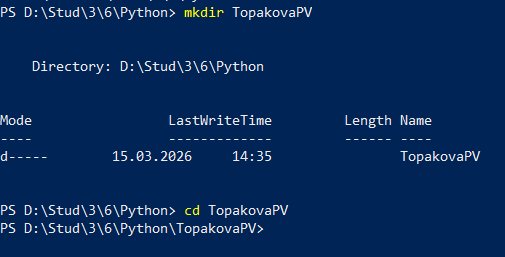   

2)  Инициализируйте git-репозиторий командой git init   
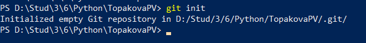   

3)  Создайте файл .gitignore и добавьте в него стандартные исключения для Python проектов (можно использовать https://github.com/github/gitignore/blob/main/Python.gitignore)   
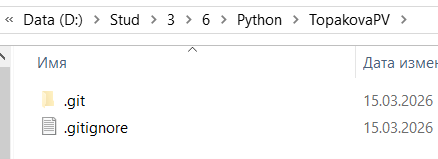   

4) Инициализируйте проект при помощи uv командой uv init   
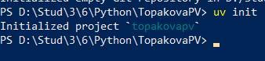   

5) С помощью uv создайте виртуальное окружение и установите FastAPI и Uvicorn   
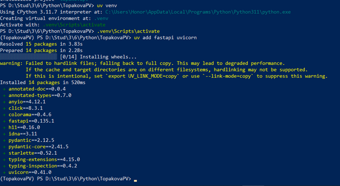   
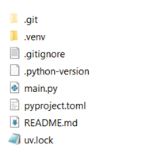   

6) Создайте файл main.py с минимальным приложением FastAPI   

7) Запустите приложение   
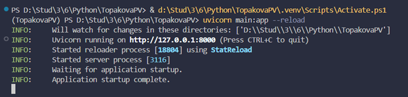   

8) Откройте http://127.0.0.1:8000 – вы должны увидеть JSON-ответ   
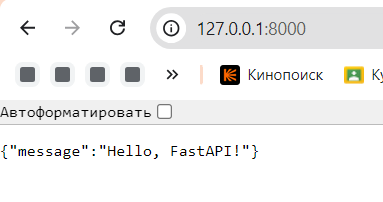   
Откройте http://127.0.0.1:8000/docs – вы должны увидеть OpenAPI документацию   
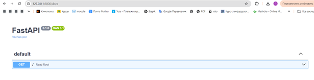   
Откройте http://127.0.0.1:8000/redoc – вы должны увидеть Redoc документацию   
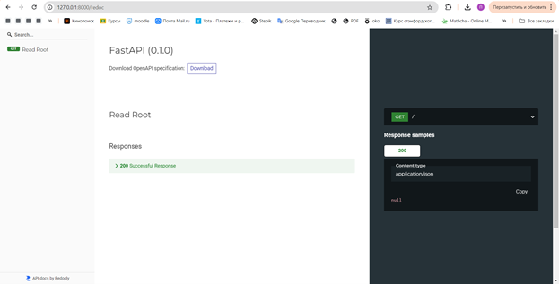   
 
9) Сделайте первый коммит    
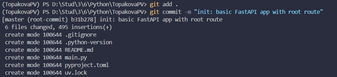   
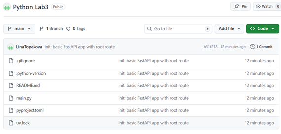  

# Задание 2   
1)	В файл main.py добавьте новый эндпоинт /items/{item_id}, который принимает:    
•	обязательный параметр пути item_id (целое число);    
•	необязательный query-параметр q (строка) со значением по умолчанию None.    
Функция должна возвращать словарь с полученными значениями.   

2) Запустите приложение   
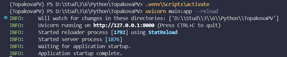   

3) Перейдите в браузере по адресу http://127.0.0.1:8000/items/42?q=test   
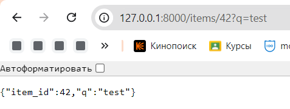   

4) Перейдите по адресу http://127.0.0.1:8000/docs   
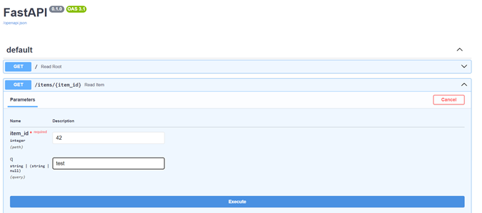   
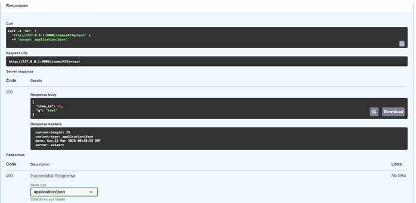   
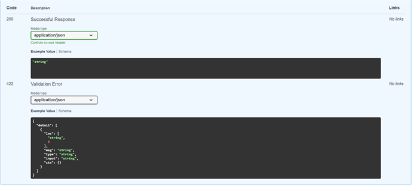   

5) Сделайте коммит:   
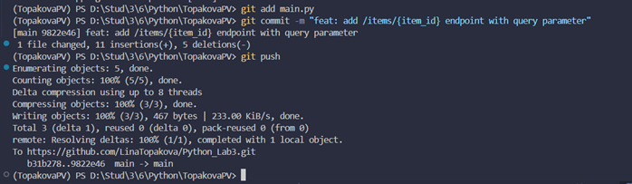  

# Задание 3
1) Установите pydantic. Он уже установлен вместе с FastAPI, это называется 
транзитивная зависимость, вы можете импортировать и использовать такую 
библиотеку в своем коде, она установлена в venv вместе с fastapi. Но хорошей 
практикой является явное добавление всех библиотек, которые вы напрямую 
используете:    
uv add pydantic    
Глобально такой подход позволяет вам не зависеть от переменчивого внутреннего 
устройства библиотек и гарантировать, что ваш код не сломается на очередном витке 
обновления библиотек. Также это повышает читаемость вашего проекта, ведь сразу 
становится понятно, что именно явно используется в вашем коде. 
Проверьте файл pyproject.toml, список dependencies, там должен появиться pydantic
   
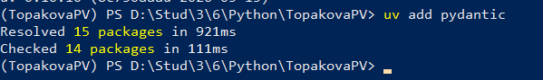   
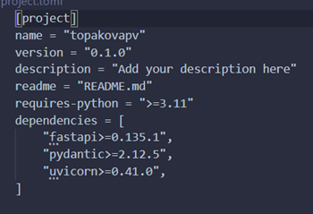   

2)  В файле main.py импортируйте BaseModel из pydantic и определите модель Item: 
from pydantic import BaseModel    
3) Добавьте новый эндпоинт для создания товара (метод POST) по пути /items/, который принимает объект Item и возвращает его же (имитируем сохранения, мы специально возвращаем созданный объект, чтобы отправляющий запрос мог убедиться, что все правильно).   

4) Проверьте работоспособность эндпоинта (например, через /docs)  
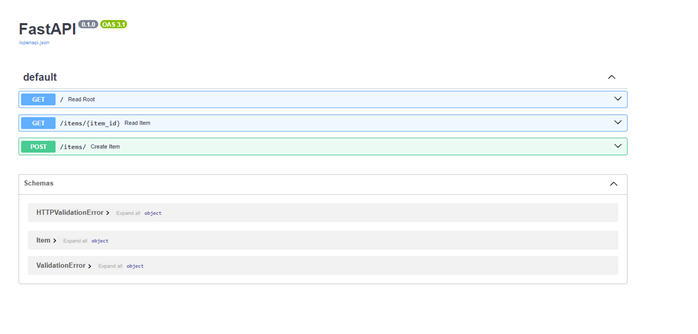   
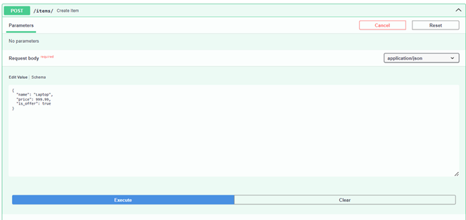   
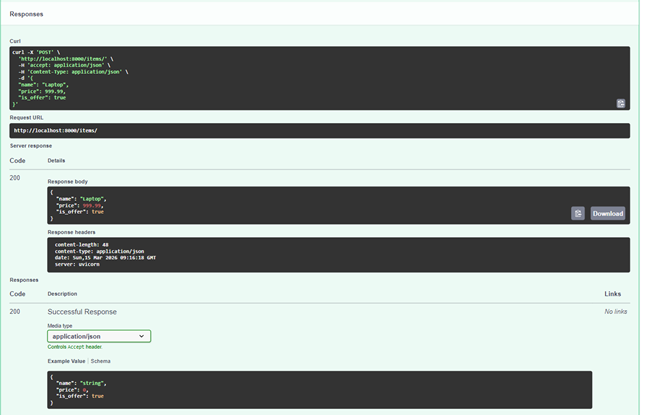   

5) Сделайте коммит   
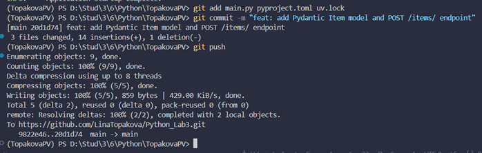   

# Задание 4
1)	Создайте директорию app и внутри неё файл routers/items.py   
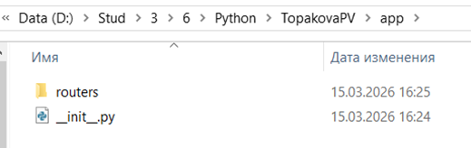   
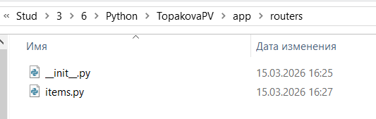   

2)	Перенесите все эндпоинты, связанные с товарами (GET /items/{item_id}, POST 
/items/), в файл app/routers/items.py, используя APIRouter   
3)	В основном файле main.py подключите роутер:   
4)	Убедитесь, что приложение по-прежнему работает (маршруты доступны по тем же адресам).   
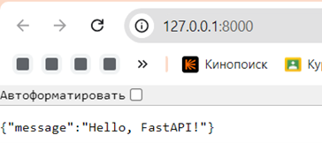   
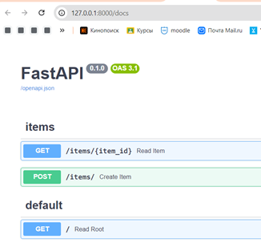   
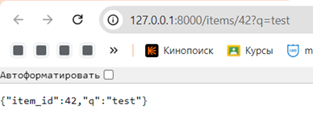  

5)	Сделайте коммит   
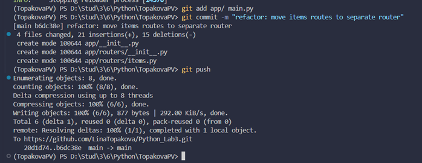   

# Задание 5
1)	Установите pydantic-settings    
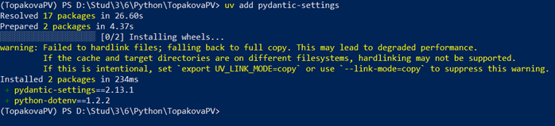   

2)	Создайте файл app/config.py с классом настроек   
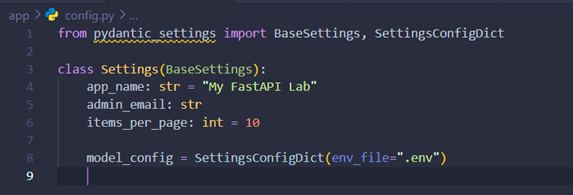   

3)	В корне проекта создайте файл .env с содержимым  
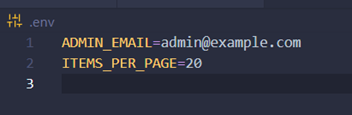   

4)	В main.py создайте экземпляр настроек и передайте title в FastAPI   
5)	Добавьте эндпоинт, который возвращает информацию о настройках (например, 
/info):   
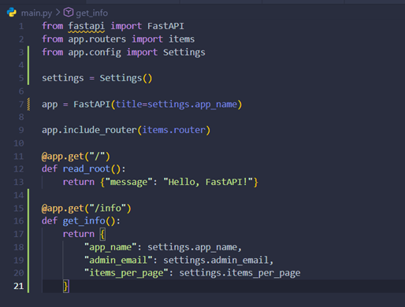   

6)	Проверьте, что значение items_per_page подхватилось из .env (должно быть 20)   
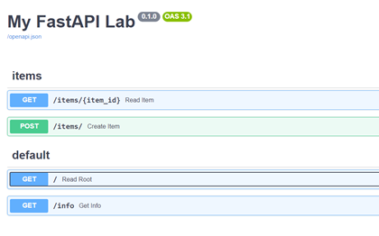   
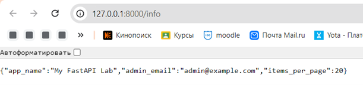   

7)	Сделайте коммит, не забыв проверить, что .env находится в .gitignore (секреты не 
должны попадать в репозиторий). В .gitignore уже должна быть строка .env.   
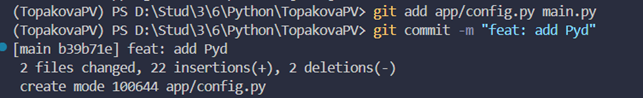   

# Задание 6
1) Проверка кода   
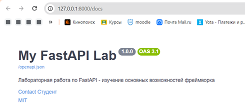   
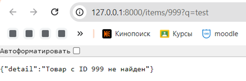    
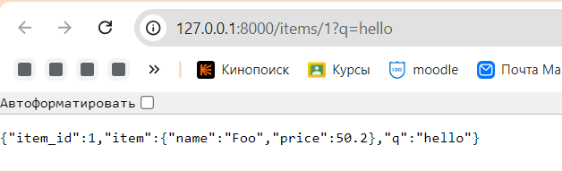   

2) Коммит   
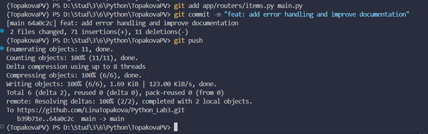   

# Задание 7
1) Проверка кода   
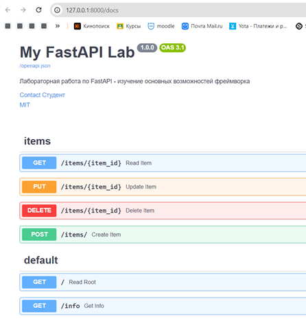   

Попробуем создать существующий товар   
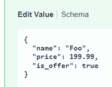   
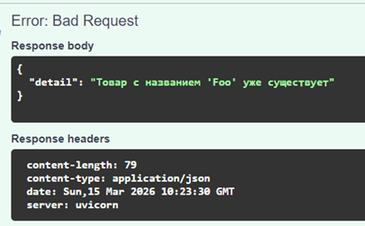   

Изменим цену  
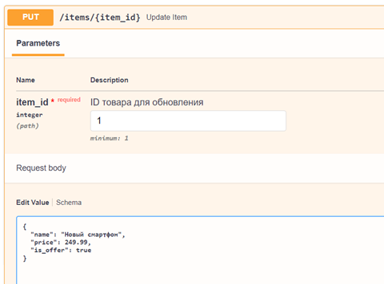   
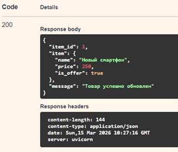   

Удаление товара   
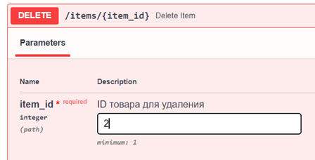   
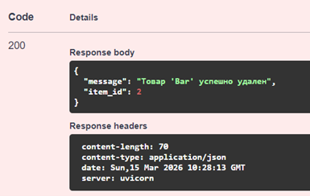   

2) Коммит   
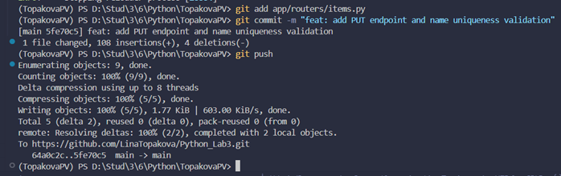   

# Задание 8
1) проверка логов   
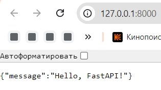   
   
   
   
   

2) Коммит   
   

# Задание 9

